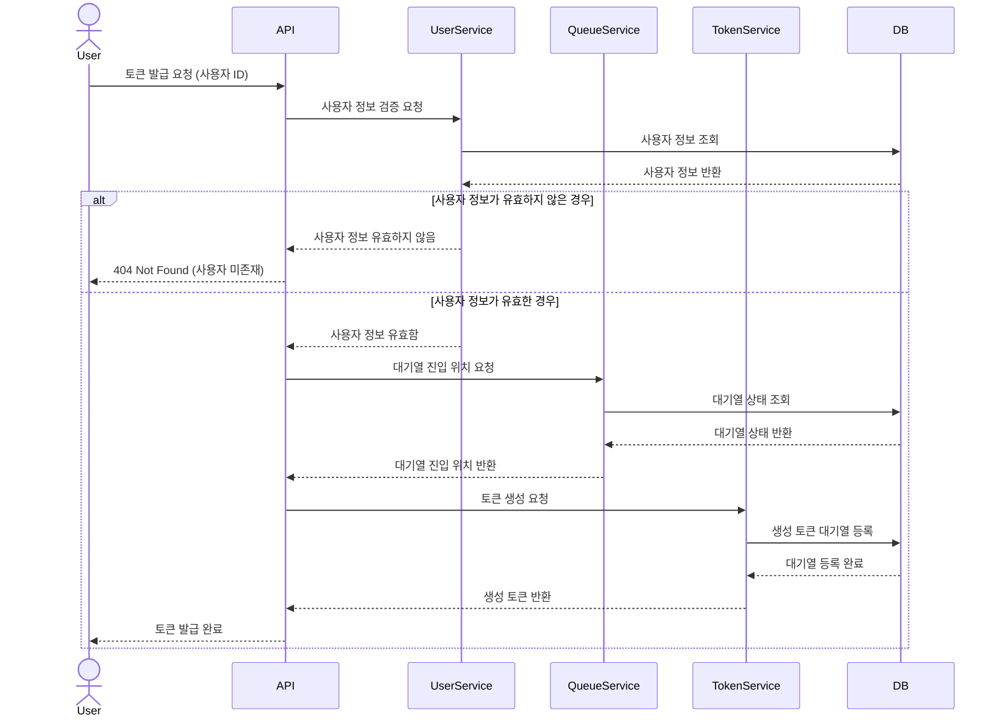
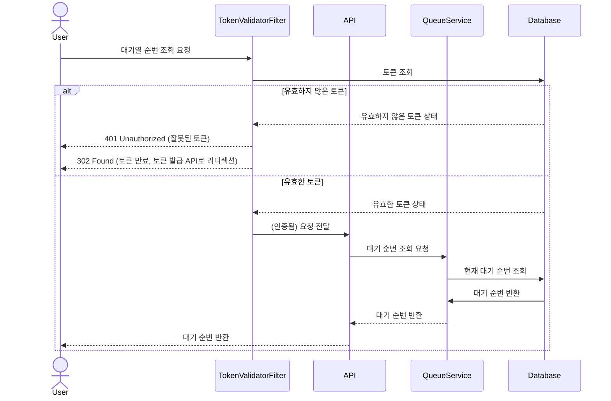
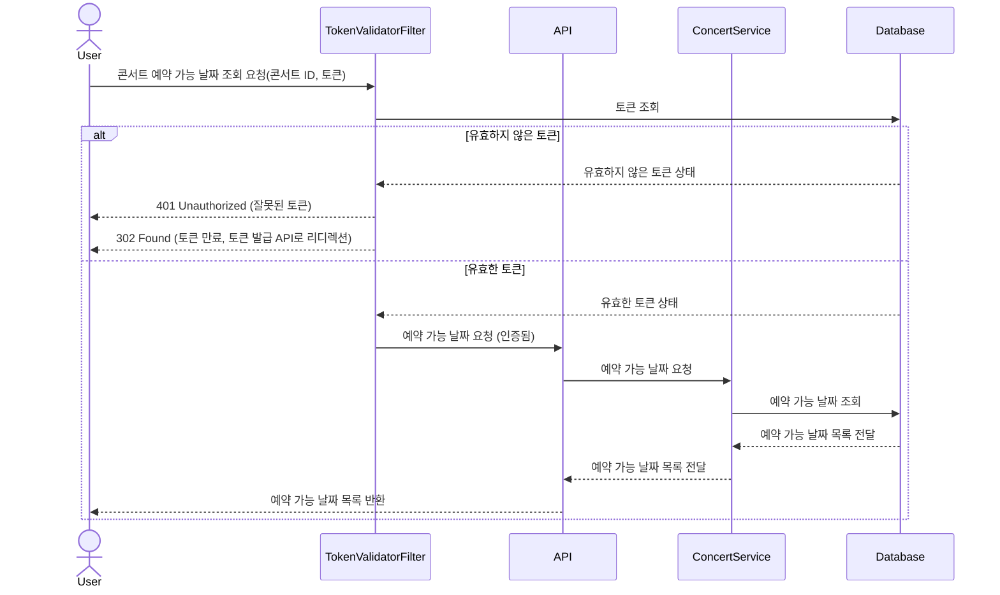
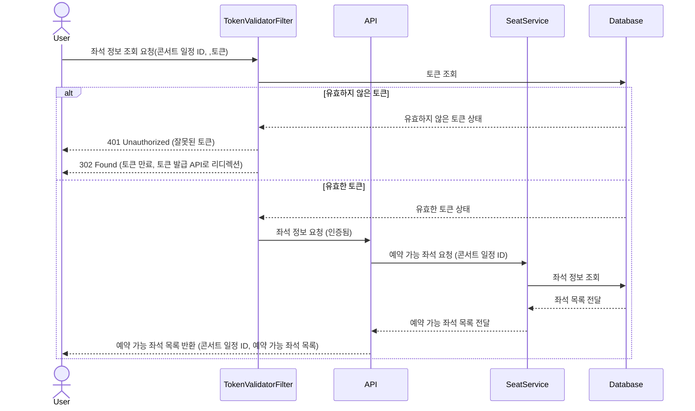
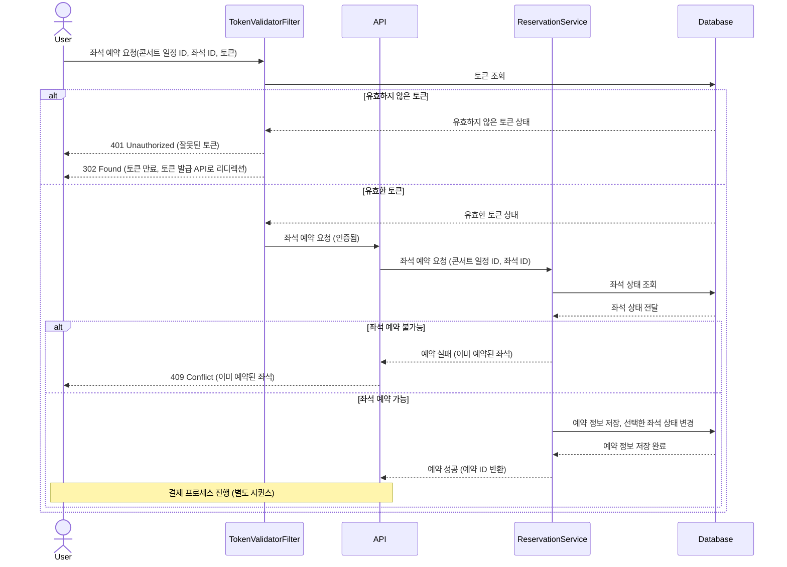
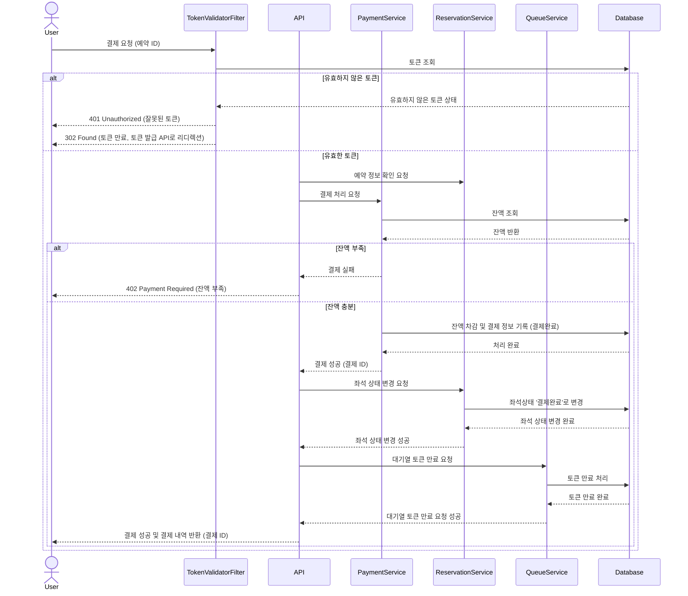
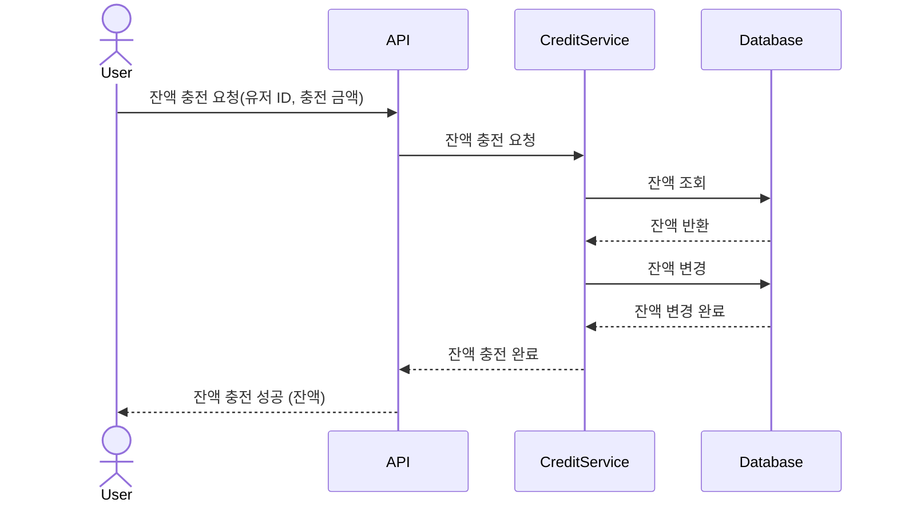
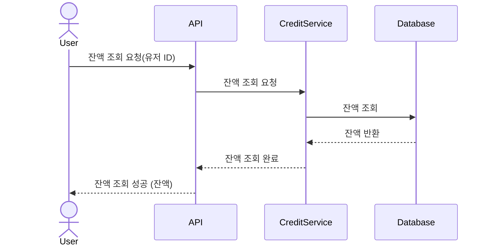

# 토큰 발급 API

```mermaid
sequenceDiagram
    actor User
    participant API
    participant UserService
    participant QueueService
    participant TokenService
    participant DB

    User->>API: 토큰 발급 요청 (사용자 ID)
    API->>UserService: 사용자 정보 검증 요청
    UserService->>DB: 사용자 정보 조회
    DB-->>UserService: 사용자 정보 반환
    alt 사용자 정보가 유효하지 않은 경우
        UserService-->>API: 사용자 정보 유효하지 않음
        API-->>User: 404 Not Found (사용자 미존재)
    else 사용자 정보가 유효한 경우
        UserService-->>API: 사용자 정보 유효함
        API->>QueueService: 대기열 진입 위치 요청
        QueueService->>DB: 대기열 상태 조회
            DB -->> QueueService: 대기열 상태 반환
            QueueService-->>API: 대기열 진입 위치 반환
            API->>TokenService: 토큰 생성 요청
            TokenService->>DB: 생성 토큰 대기열 등록
	            DB -->>TokenService: 대기열 등록 완료
	            TokenService-->>API: 생성 토큰 반환
	            API-->>User: 토큰 발급 완료
    end
```

# **대기열 순번 확인 API(대기열)**

```mermaid
sequenceDiagram
    actor User
    participant TokenValidatorFilter
    participant API
    participant QueueService
    participant Database

    User->>TokenValidatorFilter: 대기열 순번 조회 요청
    TokenValidatorFilter->>Database: 토큰 조회
    alt 유효하지 않은 토큰
        Database-->>TokenValidatorFilter: 유효하지 않은 토큰 상태
        TokenValidatorFilter-->>User: 401 Unauthorized (잘못된 토큰)
        TokenValidatorFilter-->>User: 302 Found (토큰 만료, 토큰 발급 API로 리디렉션)
    else 유효한 토큰
        Database-->>TokenValidatorFilter: 유효한 토큰 상태
        TokenValidatorFilter->>API: (인증됨) 요청 전달
        API->>QueueService: 대기 순번 조회 요청
        QueueService->>Database: 현재 대기 순번 조회
        Database->>QueueService: 대기 순번 반환
        QueueService-->>API: 대기 순번 반환
        API-->>User: 대기 순번 반환
    end

```

# 예약 가능한 날짜 조회 API(대기열)

```mermaid
sequenceDiagram
    actor User
    participant TokenValidatorFilter
    participant API
    participant ConcertService
    participant Database

    User->>TokenValidatorFilter: 콘서트 예약 가능 날짜 조회 요청(콘서트 ID, 토큰)
    TokenValidatorFilter->>Database: 토큰 조회
    alt 유효하지 않은 토큰
        Database-->>TokenValidatorFilter: 유효하지 않은 토큰 상태
        TokenValidatorFilter-->>User: 401 Unauthorized (잘못된 토큰)
        TokenValidatorFilter-->>User: 302 Found (토큰 만료, 토큰 발급 API로 리디렉션)
    else 유효한 토큰
        Database-->>TokenValidatorFilter: 유효한 토큰 상태
        TokenValidatorFilter->>API: 예약 가능 날짜 요청 (인증됨)
        API->>ConcertService: 예약 가능 날짜 요청
        ConcertService->>Database: 예약 가능 날짜 조회
        Database-->>ConcertService: 예약 가능 날짜 목록 전달
        ConcertService-->>API: 예약 가능 날짜 목록 전달
        API-->>User: 예약 가능 날짜 목록 반환
    end
```

# 예약 가능한 좌석 조회 API(대기열)

```mermaid
sequenceDiagram
    actor User
    participant TokenValidatorFilter
    participant API
    participant SeatService
    participant Database

    User->>TokenValidatorFilter: 좌석 정보 조회 요청(콘서트 일정 ID, ,토큰)
    TokenValidatorFilter->>Database: 토큰 조회
    alt 유효하지 않은 토큰
        Database-->>TokenValidatorFilter: 유효하지 않은 토큰 상태
        TokenValidatorFilter-->>User: 401 Unauthorized (잘못된 토큰)
        TokenValidatorFilter-->>User: 302 Found (토큰 만료, 토큰 발급 API로 리디렉션)
    else 유효한 토큰
        Database-->>TokenValidatorFilter: 유효한 토큰 상태
        TokenValidatorFilter->>API: 좌석 정보 요청 (인증됨)
        API->>SeatService: 예약 가능 좌석 요청 (콘서트 일정 ID)
        SeatService->>Database: 좌석 정보 조회
        Database-->>SeatService: 좌석 목록 전달
        SeatService-->>API: 예약 가능 좌석 목록 전달
        API-->>User: 예약 가능 좌석 목록 반환 (콘서트 일정 ID, 예약 가능 좌석 목록)
    end
```

# 좌석 예약 API(대기열)

```mermaid
sequenceDiagram
    actor User
    participant TokenValidatorFilter
    participant API
    participant ReservationService
    participant Database

    User->>TokenValidatorFilter: 좌석 예약 요청(콘서트 일정 ID, 좌석 ID, 토큰)
    TokenValidatorFilter->>Database: 토큰 조회
    alt 유효하지 않은 토큰
        Database-->>TokenValidatorFilter: 유효하지 않은 토큰 상태
        TokenValidatorFilter-->>User: 401 Unauthorized (잘못된 토큰)
        TokenValidatorFilter-->>User: 302 Found (토큰 만료, 토큰 발급 API로 리디렉션)
    else 유효한 토큰
        Database-->>TokenValidatorFilter: 유효한 토큰 상태
        TokenValidatorFilter->>API: 좌석 예약 요청 (인증됨)
        API->>ReservationService: 좌석 예약 요청 (콘서트 일정 ID, 좌석 ID)
        ReservationService->>Database: 좌석 상태 조회
        Database-->>ReservationService: 좌석 상태 전달
        alt 좌석 예약 불가능
		        ReservationService-->>API: 예약 실패 (이미 예약된 좌석)
		        API-->>User: 409 Conflict (이미 예약된 좌석)
        else 좌석 예약 가능
		        ReservationService->>Database: 예약 정보 저장, 선택한 좌석 상태 변경
		        Database-->>ReservationService: 예약 정보 저장 완료
		        ReservationService-->>API: 예약 성공 (예약 ID 반환)
		        note over User, API: 결제 프로세스 진행 (별도 시퀀스)
        end
    end
```

# 결제 API(대기열)

```mermaid
sequenceDiagram
    actor User
    participant TokenValidatorFilter
    participant API
    participant PaymentService
    participant ReservationService
    participant QueueService
    participant Database

    User->>TokenValidatorFilter: 결제 요청 (예약 ID)
    TokenValidatorFilter->>Database: 토큰 조회
    alt 유효하지 않은 토큰
        Database-->>TokenValidatorFilter: 유효하지 않은 토큰 상태
        TokenValidatorFilter-->>User: 401 Unauthorized (잘못된 토큰)
        TokenValidatorFilter-->>User: 302 Found (토큰 만료, 토큰 발급 API로 리디렉션)
    else 유효한 토큰
		    API->>ReservationService: 예약 정보 확인 요청
		    API->>PaymentService: 결제 처리 요청
		    PaymentService->>Database: 잔액 조회
		    Database-->>PaymentService: 잔액 반환
		    alt 잔액 부족
		        PaymentService-->>API: 결제 실패
		        API-->>User: 402 Payment Required (잔액 부족)
		    else 잔액 충분
		        PaymentService->>Database: 잔액 차감 및 결제 정보 기록 (결제완료)
		        Database-->>PaymentService: 처리 완료
		        PaymentService-->>API: 결제 성공 (결제 ID)
		        API->>ReservationService: 좌석 상태 변경 요청
		        ReservationService->>Database: 좌석상태 '결제완료'로 변경
		        Database-->>ReservationService: 좌석 상태 변경 완료
		        ReservationService-->>API: 좌석 상태 변경 성공
		        API->>QueueService: 대기열 토큰 만료 요청
		        QueueService->>Database: 토큰 만료 처리
		        Database-->>QueueService: 토큰 만료 완료
		        QueueService-->>API: 대기열 토큰 만료 요청 성공
		        API-->>User: 결제 성공 및 결제 내역 반환 (결제 ID)
		    end
		end
```

# 잔액 충전 API

```mermaid
sequenceDiagram
    actor User
    participant API
    participant CreditService
    participant Database
    
    User->>API: 잔액 충전 요청(유저 ID, 충전 금액)
		API->>CreditService: 잔액 충전 요청
		CreditService->>Database: 잔액 조회
		Database-->>CreditService: 잔액 반환 
		CreditService->>Database: 잔액 변경
		Database-->>CreditService: 잔액 변경 완료
		CreditService-->>API: 잔액 충전 완료
		API-->>User: 잔액 충전 성공 (잔액)
```

# 잔액 조회 API

```mermaid
sequenceDiagram
    actor User
    participant API
    participant CreditService
    participant Database
    
    User->>API: 잔액 조회 요청(유저 ID)
		API->>CreditService: 잔액 조회 요청
		CreditService->>Database: 잔액 조회
		Database-->>CreditService: 잔액 반환 
		CreditService-->>API: 잔액 조회 완료
		API-->>User: 잔액 조회 성공 (잔액)
```